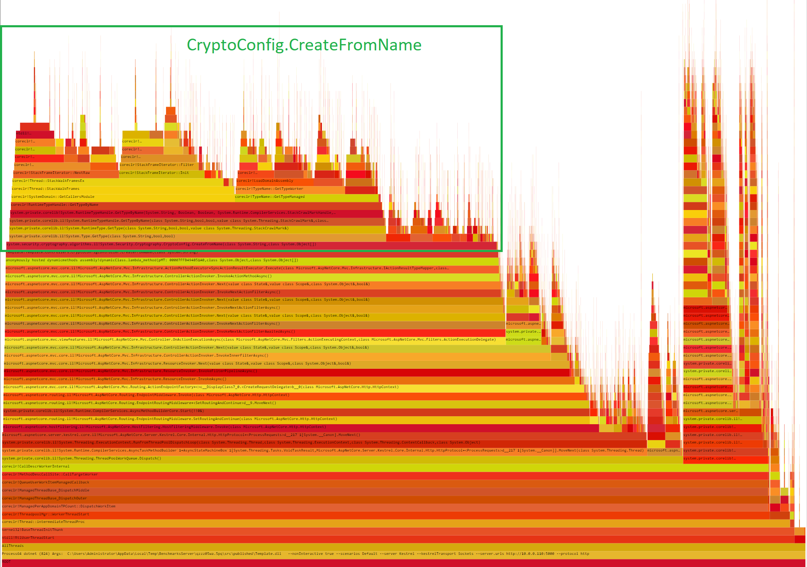
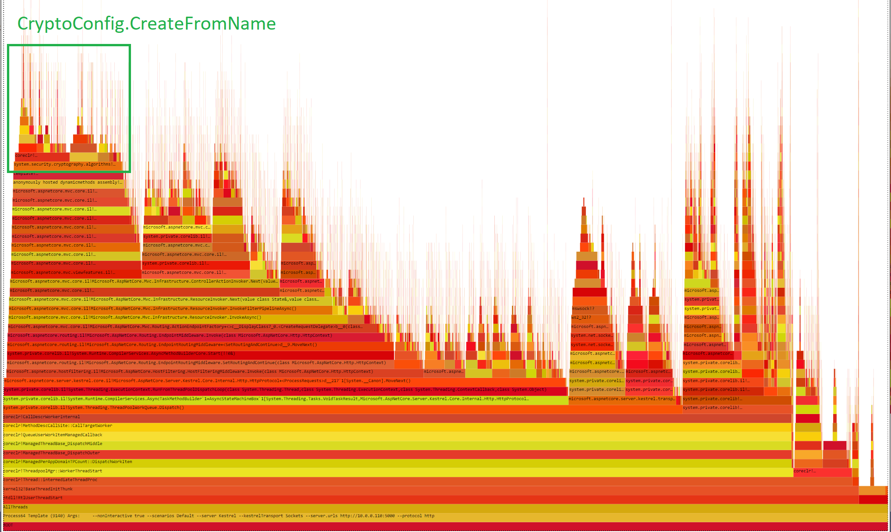

# ASP.NET Template Benchmark App

This folder contains only a template of sample ASP.NET Core app that can be run using the [crank](https://github.com/dotnet/crank/blob/master/src/Microsoft.Crank.Controller/README.md).

The goal is to make it very easy to reuse this template app to quickly modify it and run your own benchmark(s).

## Usage

1. Clone this repo.
2. Modify the template project: replace [existing route](./Startup.cs#L25) with a method that you want to test.
3. Use [crank](https://github.com/dotnet/crank/blob/main/src/Microsoft.Crank.Controller/README.md) to run the benchmark.

## Sample investigation

### Introduction

As an example we are going to use issue reported in [corefx/39600](https://github.com/dotnet/corefx/pull/39600) which says:

> CryptoConfig.CreateFromName in the dotnet core is about 4.5 times slower than the same method in .NET

Why a simple micro benchmark is not enough?

> This lock is really bad and causes contention issues when our web app is running on E20 Azure VMs.

Which means that we need to run this code in parallel to reproduce the problem.

### Git clone

The first step is to clone this repository and open the [benchmarks.sln](../../../../benchmarks.sln) in default IDE:

```cmd
git clone https://github.com/aspnet/Benchmarks
cd Benchmarks
explorer benchmarks.sln
```

### Modify the template

The next step is to replace [existing route](./Startup.cs#L25) with a method that reproduces the problem:

```cs
using System.Runtime.CompilerServices;
using System.Security.Cryptography;
using System.Threading.Tasks;
using Microsoft.AspNetCore.Builder;
using Microsoft.AspNetCore.Hosting;
using Microsoft.AspNetCore.Routing;
using Microsoft.Extensions.Configuration;

namespace Template
{
    public class Startup
    {
        public Startup(IConfiguration configuration) => Configuration = configuration;

        public IConfiguration Configuration { get; }

        // This method gets called by the runtime. Use this method to configure the HTTP request pipeline.
        public void Configure(IApplicationBuilder app, IWebHostEnvironment env)
        {
            app.UseRouting();

            app.UseEndpoints(routeBuilder =>
            {
                routeBuilder.Map("CryptoConfig/CreateFromName/{name}", context =>
                {
                    string name = (string)context.GetRouteValue("name");

                    for (var i = 0; i < 16; i++)
                    {
                        Consume(CryptoConfig.CreateFromName(name));
                    }

                    return Task.CompletedTask;
                });
            });
        }

        // avoid possible dead code elimination
        [MethodImpl(MethodImplOptions.NoInlining)]
        private static void Consume<T>(in T _) { }
    }
}
```

Now, if we want to benchmark this method using "RSA" argument we need to specify following argument for the [crank](https://github.com/dotnet/crank/blob/main/src/Microsoft.Crank.Controller/README.md):

```cmd
--load.variables.path /CryptoConfig/CreateFromName/RSA
```

### Run the benchmark

Now we run the benchmark using following command (assuming that we know the benchmark server and client machine address):

```cmd
cd src/BenchmarksApps/Samples/Template
crank -- `
    --config ./sample.yml `
    --scenario sample `
    --profile aspnet-perf-win `
    --load.variables.path /CryptoConfig/CreateFromName/RSA `
```

Sample output:

```log
| application           |                         |
| --------------------- | ----------------------- |
| CPU Usage (%)         | 99                      |
| Cores usage (%)       | 1,186                   |
| Working Set (MB)      | 152                     |
| Build Time (ms)       | 2,889                   |
| Start Time (ms)       | 252                     |
| Published Size (KB)   | 84,768                  |
| .NET Core SDK Version | 6.0.100-alpha.1.20568.5 |


| load                   |         |
| ---------------------- | ------- |
| CPU Usage (%)          | 20      |
| Cores usage (%)        | 244     |
| Working Set (MB)       | 48      |
| Build Time (ms)        | 4,804   |
| Start Time (ms)        | 0       |
| Published Size (KB)    | 76,401  |
| .NET Core SDK Version  | 3.1.404 |
| First Request (ms)     | 94      |
| Requests/sec           | 41,129  |
| Requests               | 621,031 |
| Mean latency (ms)      | 12.56   |
| Max latency (ms)       | 205.56  |
| Bad responses          | 0       |
| Socket errors          | 0       |
| Read throughput (MB/s) | 3.61    |
| Latency 50th (ms)      | 12.86   |
| Latency 75th (ms)      | 13.68   |
| Latency 90th (ms)      | 14.77   |
| Latency 99th (ms)      | 20.87   |
```

### Collect trace

The next step is to collect the trace and find out where the problem really is. To do that we just extend the previous command with:

```cmd
--application.collect true 
```

Sample output:

```log
[11:53:47.819] Stopping job 'application' ...
[11:53:51.172] Collecting trace file 'application.12-08-11-53-51.etl.zip' ...
[11:56:06.066] Downloading trace file...
[11:59:34.605] Deleting job 'application' ...
```

**Note:** Downloading trace file can take 10s of seconds.

### Identifying the problem

To identify the problem we can open the trace file with [PerfView](https://github.com/Microsoft/perfview) and [analyze it](https://adamsitnik.com/Sample-Perf-Investigation/#analysing-the-trace-file)




### Validating the fix

To validate the fix, we need to send a new version of given library using the `--application.options.outputFiles` command line argument. The benchmarking infrastructure is going to publish a self-contained version of provided `Template` app and overwrite existing file with the one that we have provided. Example:


```cmd
--application.options.outputFiles "C:\Projects\runtime\artifacts\bin\System.Security.Cryptography.Algorithms\net6.0-windows-Release\System.Security.Cryptography.Algorithms.dll"
```

The trace file captured after introducing the change shows that `CryptoConfig.CreateFromName` is not a performance bottleneck anymore:


