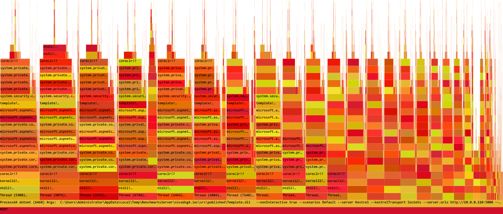
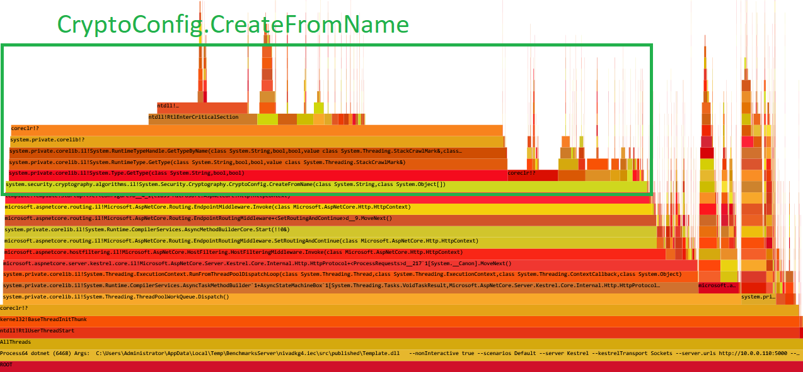
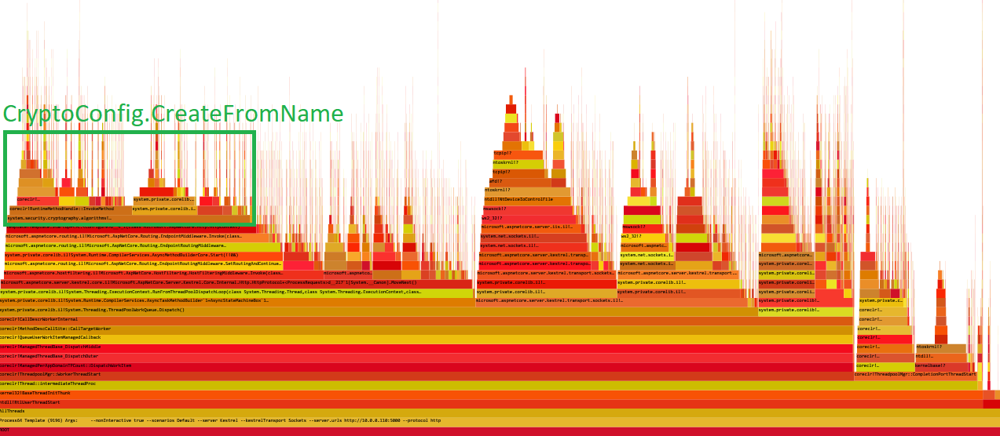

# ASP.NET Template Benchmark App

This folder contains only a template of sample ASP.NET Core app that can be run using the [BenchmarksDriver](../../../BenchmarksDriver/README.md).

The goal is to make it very easy to reuse this template app to quickly modify it and run your own benchmark(s).

## Usage

1. Clone this repo.
2. Modify the template project: replace [existing route](./Startup.cs#L25) with a method that you want to test.
3. Use [BenchmarksDriver](../../../BenchmarksDriver/README.md) to run the benchmark.

## Sample investigation

### Introduction

As an example we are going to use issue reported in [corefx/39600](https://github.com/dotnet/corefx/pull/39600) which says:

> CryptoConfig.CreateFromName in the dotnet core is about 4.5 times slower than the same method in .NET

Why a simple micro benchmark is not enough?

> This lock is really bad and causes contention issues when our web app is running on E20 Azure VMs.

Which means that we need to run this code in parallel to reproduce the problem.

### Git clone

The first step is to clone this repository and open the [benchmarks.sln](../../../../benchmarks.sln) in default IDE:

```cmd
git clone https://github.com/aspnet/Benchmarks
cd Benchmarks
explorer benchmarks.sln
```

### Modify the template

The next step is to replace [existing route](./Startup.cs#L25) with a method that reproduces the problem:

```cs
using System.Runtime.CompilerServices;
using System.Security.Cryptography;
using System.Threading.Tasks;
using Microsoft.AspNetCore.Builder;
using Microsoft.AspNetCore.Hosting;
using Microsoft.AspNetCore.Routing;
using Microsoft.Extensions.Configuration;

namespace Template
{
    public class Startup
    {
        public Startup(IConfiguration configuration) => Configuration = configuration;

        public IConfiguration Configuration { get; }

        // This method gets called by the runtime. Use this method to configure the HTTP request pipeline.
        public void Configure(IApplicationBuilder app, IWebHostEnvironment env)
        {
            app.UseRouting();

            app.UseEndpoints(routeBuilder =>
            {
                routeBuilder.Map("CryptoConfig/CreateFromName/{name}", context =>
                {
                    string name = (string)context.GetRouteValue("name");

                    for (var i = 0; i < 16; i++)
                    {
                        Consume(CryptoConfig.CreateFromName(name));
                    }

                    return Task.CompletedTask;
                });
            });
        }

        // avoid possible dead code elimination
        [MethodImpl(MethodImplOptions.NoInlining)]
        private static void Consume<T>(in T _) { }
    }
}
```

Now, if we want to benchmark this method using "RSA" argument we need to specify following argument for the [BenchmarksDriver](../../../BenchmarksDriver/README.md):

```cmd
--path /CryptoConfig/CreateFromName/RSA
```

### Run the benchmark

Now we run the benchmark using following command (assuming that we know the benchmark server and client machine address):

```cmd
cd src/BenchmarksDriver
dotnet run -- `
    --server $secret1 --client $secret2 `
    --source ..\BenchmarksApps\Samples\Template\ `
    --project-file Template.csproj `
    --path /CryptoConfig/CreateFromName/RSA `
```

Sample output:

```log
RequestsPerSecond:           48,948
Max CPU (%):                 93
WorkingSet (MB):             161
Avg. Latency (ms):           5.23
Startup (ms):                202
First Request (ms):          59.91
Latency (ms):                0.4
Total Requests:              738,567
Duration: (ms)               15,090
Socket Errors:               0
Bad Responses:               0
```

### Collect trace

The next step is to collect the trace and find out where the problem really is. To do that we just extend the previous command with:

```cmd
--collect-trace
```

Sample output:

```log
Post-processing profiler trace, this can take 10s of seconds...
Trace arguments: BufferSizeMB=1024;CircularMB=1024;clrEvents=JITSymbols;kernelEvents=process+thread+ImageLoad+Profile
Downloading trace: trace.08-13-07-10-08.RPS-227K.etl.zip
```

### Identifying the problem

To identify the problem we can open the trace file with [PerfView](https://github.com/Microsoft/perfview) and [analyze it](https://adamsitnik.com/Sample-Perf-Investigation/#analysing-the-trace-file)





### Validating the fix

To validate the fix, we need to send a new version of given library using the `--output-file` command line argument. The benchmarking infrastructure is going to publish a self-contained version of provided `Template` app and overwrite existing file with the one that we have provided. Example:


```cmd
--output-file "C:\Projects\corefx\artifacts\bin\System.Security.Cryptography.Algorithms\netcoreapp-Windows_NT-Release\System.Security.Cryptography.Algorithms.dll"
```

```log
RequestsPerSecond:           226,818
Max CPU (%):                 79
WorkingSet (MB):             159
Avg. Latency (ms):           2.23
Startup (ms):                322
First Request (ms):          62.91
Latency (ms):                0.41
Total Requests:              3,424,868
Duration: (ms)               15,100
Socket Errors:               0
Bad Responses:               0
```

The trace file captured after introducing the change shows that `CryptoConfig.CreateFromName` is not a performance bottleneck anymore:


